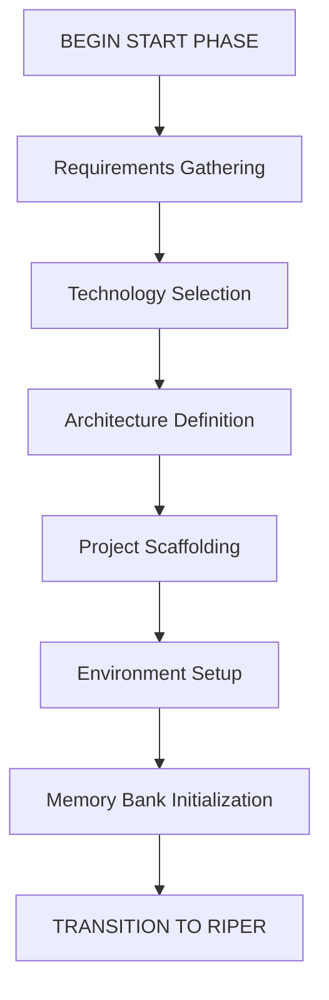
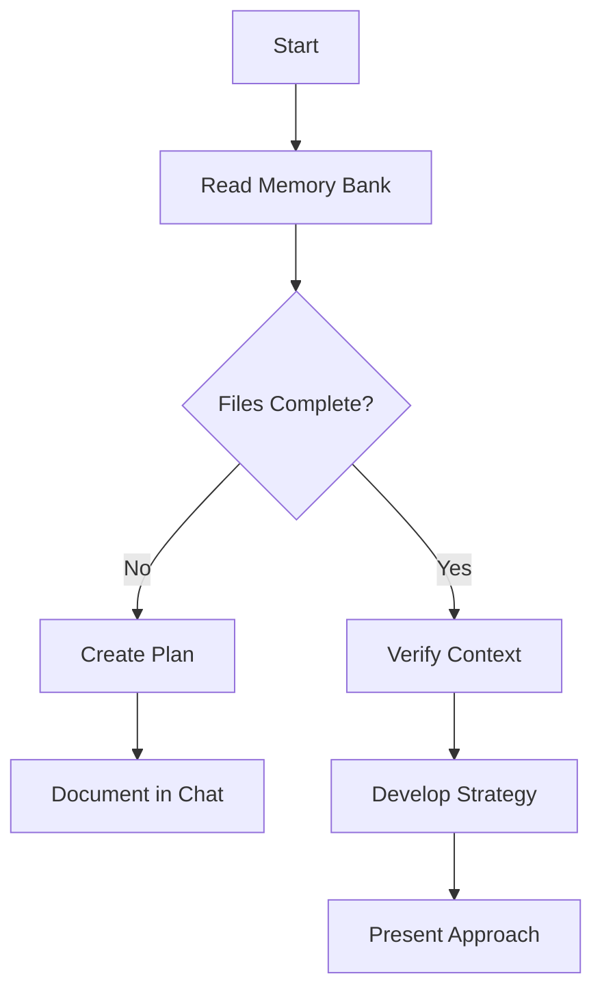
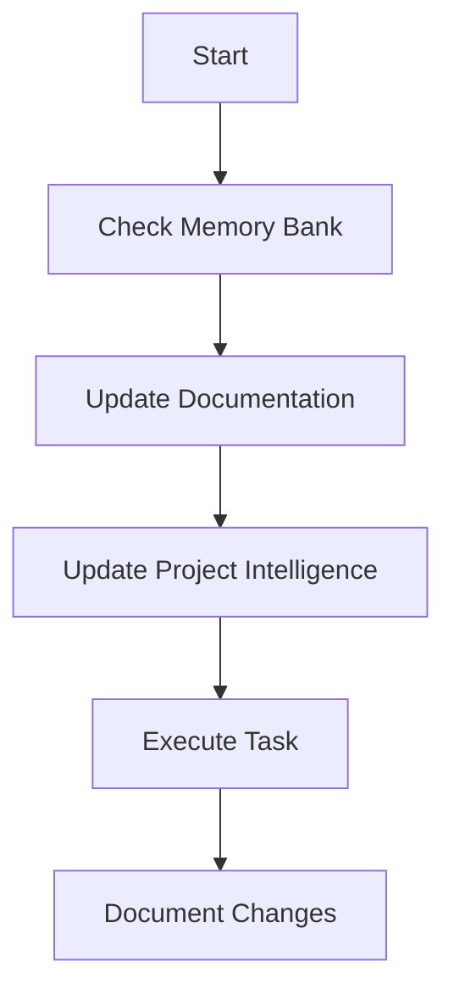

<!-- Generated by SpecStory -->

# Project Initialization Start (2025-04-23 10:00:07)

_**User**_

/start

---

_**Assistant**_

[MODE: RESEARCH]

我将为您启动START阶段，开始项目初始化过程。

---

### Rule: start-phase

**"CursorRIPER Framework - START Phase"**

```markdown
<!-- Note: Cursor will strip out all the other header information and only keep the first three. -->
# CursorRIPER Framework - START Phase
# Version 1.0.1

## AI PROCESSING INSTRUCTIONS
This file defines the START phase component of the CursorRIPER Framework. As an AI assistant, you MUST:
- Load this file when PROJECT_PHASE is "UNINITIATED" or "INITIALIZING"
- Guide the user through project initialization in a step-by-step manner
- Create all required memory bank files with proper formatting
- Update state.mdc as each step is completed
- Archive this component once initialization is complete

## START PHASE OVERVIEW

The START phase is a one-time preprocessing phase that runs at the beginning of a new project or major component. It focuses on project initialization, scaffolding, and setting up the Memory Bank with baseline information.



## START PHASE PROCESS

[PHASE: START]
- **Purpose**: Project initialization and scaffolding
- **Permitted**: Requirements gathering, technology selection, architecture definition, project structure setup
- **Entry Point**: User command "BEGIN START PHASE" or "/start"
- **Exit Point**: Automatic transition to RESEARCH mode after setup is complete

## STEP-BY-STEP INITIALIZATION

### Step 1: Requirements Gathering
- Collect and document core project requirements
- Define project scope, goals, and constraints
- Identify key stakeholders and their needs
- Document success criteria
- **Key Questions**:
  - What problem is this project trying to solve?
  - Who are the primary users or stakeholders?
  - What are the must-have features?
  - What are the nice-to-have features?
  - What are the technical constraints?
  - What is the timeline for completion?
- **Output**: Create projectbrief.md with gathered requirements

### Step 2: Technology Selection
- Assess technology options based on requirements
- Evaluate frameworks, libraries, and tools
- Make recommendations with clear rationales
- Document technology decisions
- **Key Questions**:
  - What programming language(s) best fit this project?
  - What frameworks or libraries would be most appropriate?
  - What database technology should be used?
  - What deployment environment is targeted?
  - Are there any specific performance requirements?
  - What testing frameworks should be used?
- **Output**: Add technology decisions to techContext.md

### Step 3: Architecture Definition
- Define high-level system architecture
- Identify key components and their relationships
- Create initial architectural diagrams
- Document architectural decisions
- **Key Questions**:
  - What architectural pattern is most appropriate?
  - How will the application be structured?
  - What are the key components and their responsibilities?
  - How will data flow through the system?
  - How will the system scale?
  - What security considerations need to be addressed?
- **Output**: Create systemPatterns.md with architecture definition

### Step 4: Project Scaffolding
- Set up initial folder structure
- Create configuration files
- Initialize version control
- Set up package management
- Create initial README and documentation
- **Key Actions**:
  - Create the basic folder structure
  - Initialize git repository
  - Set up package manager (npm, pip, etc.)
  - Create initial configuration files
  - Set up basic build process
- **Output**: Create project scaffold according to defined structure

### Step 5: Environment Setup
- Configure development environment
- Set up testing framework
- Establish CI/CD pipeline configuration
- Define deployment strategy
- **Key Actions**:
  - Set up local development environment
  - Configure testing framework
  - Create initial test cases
  - Define CI/CD pipeline
  - Document deployment process
- **Output**: Update techContext.md with environment setup details

### Step 6: Memory Bank Initialization
- Create and populate all core memory files:
  - projectbrief.md (if not already created)
  - systemPatterns.md (if not already created)
  - techContext.md (if not already created)
  - activeContext.md
  - progress.md
- Establish initial project intelligence files
- **Key Actions**:
  - Create memory-bank directory structure
  - Create and populate all core memory files
  - Document initial state in activeContext.md
  - Set up progress.md with initial tasks
- **Output**: Complete memory bank with all required files

## MEMORY BANK TEMPLATES

### projectbrief.md Template
```markdown
# Project Brief: [PROJECT_NAME]
*Version: 1.0*
*Created: [CURRENT_DATE]*
*Last Updated: [CURRENT_DATE]*

## Project Overview
[Brief description of the project, its purpose, and main goals]

## Core Requirements
- [REQUIREMENT_1]
- [REQUIREMENT_2]
- [REQUIREMENT_3]

## Success Criteria
- [CRITERION_1]
- [CRITERION_2]
- [CRITERION_3]

## Scope
### In Scope
- [IN_SCOPE_ITEM_1]
- [IN_SCOPE_ITEM_2]

### Out of Scope
- [OUT_OF_SCOPE_ITEM_1]
- [OUT_OF_SCOPE_ITEM_2]

## Timeline
- [MILESTONE_1]: [DATE]
- [MILESTONE_2]: [DATE]
- [MILESTONE_3]: [DATE]

## Stakeholders
- [STAKEHOLDER_1]: [ROLE]
- [STAKEHOLDER_2]: [ROLE]

---

*This document serves as the foundation for the project and informs all other memory files.*
```

### systemPatterns.md Template
```markdown
# System Patterns: [PROJECT_NAME]
*Version: 1.0*
*Created: [CURRENT_DATE]*
*Last Updated: [CURRENT_DATE]*

## Architecture Overview
[High-level description of the system architecture]

## Key Components
- [COMPONENT_1]: [PURPOSE]
- [COMPONENT_2]: [PURPOSE]
- [COMPONENT_3]: [PURPOSE]

## Design Patterns in Use
- [PATTERN_1]: [USAGE_CONTEXT]
- [PATTERN_2]: [USAGE_CONTEXT]
- [PATTERN_3]: [USAGE_CONTEXT]

## Data Flow
[Description or diagram of how data flows through the system]

## Key Technical Decisions
- [DECISION_1]: [RATIONALE]
- [DECISION_2]: [RATIONALE]
- [DECISION_3]: [RATIONALE]

## Component Relationships
[Description of how components interact with each other]

---

*This document captures the system architecture and design patterns used in the project.*
```

### techContext.md Template
```markdown
# Technical Context: [PROJECT_NAME]
*Version: 1.0*
*Created: [CURRENT_DATE]*
*Last Updated: [CURRENT_DATE]*

## Technology Stack
- Frontend: [FRONTEND_TECHNOLOGIES]
- Backend: [BACKEND_TECHNOLOGIES]
- Database: [DATABASE_TECHNOLOGIES]
- Infrastructure: [INFRASTRUCTURE_TECHNOLOGIES]

## Development Environment Setup
[Instructions for setting up the development environment]

## Dependencies
- [DEPENDENCY_1]: [VERSION] - [PURPOSE]
- [DEPENDENCY_2]: [VERSION] - [PURPOSE]
- [DEPENDENCY_3]: [VERSION] - [PURPOSE]

## Technical Constraints
- [CONSTRAINT_1]
- [CONSTRAINT_2]
- [CONSTRAINT_3]

## Build and Deployment
- Build Process: [BUILD_PROCESS]
- Deployment Procedure: [DEPLOYMENT_PROCEDURE]
- CI/CD: [CI_CD_SETUP]

## Testing Approach
- Unit Testing: [UNIT_TESTING_APPROACH]
- Integration Testing: [INTEGRATION_TESTING_APPROACH]
- E2E Testing: [E2E_TESTING_APPROACH]

---

*This document describes the technologies used in the project and how they're configured.*
```

### activeContext.md Template
```markdown
# Active Context: [PROJECT_NAME]
*Version: 1.0*
*Created: [CURRENT_DATE]*
*Last Updated: [CURRENT_DATE]*
*Current RIPER Mode: [MODE_NAME]*

## Current Focus
[Description of what we're currently working on]

## Recent Changes
- [CHANGE_1]: [DATE] - [DESCRIPTION]
- [CHANGE_2]: [DATE] - [DESCRIPTION]
- [CHANGE_3]: [DATE] - [DESCRIPTION]

## Active Decisions
- [DECISION_1]: [STATUS] - [DESCRIPTION]
- [DECISION_2]: [STATUS] - [DESCRIPTION]
- [DECISION_3]: [STATUS] - [DESCRIPTION]

## Next Steps
1. [NEXT_STEP_1]
2. [NEXT_STEP_2]
3. [NEXT_STEP_3]

## Current Challenges
- [CHALLENGE_1]: [DESCRIPTION]
- [CHALLENGE_2]: [DESCRIPTION]
- [CHALLENGE_3]: [DESCRIPTION]

## Implementation Progress
- [✓] [COMPLETED_TASK_1]
- [✓] [COMPLETED_TASK_2]
- [ ] [PENDING_TASK_1]
- [ ] [PENDING_TASK_2]

---

*This document captures the current state of work and immediate next steps.*
```

### progress.md Template
```markdown
# Progress Tracker: [PROJECT_NAME]
*Version: 1.0*
*Created: [CURRENT_DATE]*
*Last Updated: [CURRENT_DATE]*

## Project Status
Overall Completion: [PERCENTAGE]%

## What Works
- [FEATURE_1]: [COMPLETION_STATUS] - [NOTES]
- [FEATURE_2]: [COMPLETION_STATUS] - [NOTES]
- [FEATURE_3]: [COMPLETION_STATUS] - [NOTES]

## What's In Progress
- [FEATURE_4]: [PROGRESS_PERCENTAGE]% - [NOTES]
- [FEATURE_5]: [PROGRESS_PERCENTAGE]% - [NOTES]
- [FEATURE_6]: [PROGRESS_PERCENTAGE]% - [NOTES]

## What's Left To Build
- [FEATURE_7]: [PRIORITY] - [NOTES]
- [FEATURE_8]: [PRIORITY] - [NOTES]
- [FEATURE_9]: [PRIORITY] - [NOTES]

## Known Issues
- [ISSUE_1]: [SEVERITY] - [DESCRIPTION] - [STATUS]
- [ISSUE_2]: [SEVERITY] - [DESCRIPTION] - [STATUS]
- [ISSUE_3]: [SEVERITY] - [DESCRIPTION] - [STATUS]

## Milestones
- [MILESTONE_1]: [DUE_DATE] - [STATUS]
- [MILESTONE_2]: [DUE_DATE] - [STATUS]
- [MILESTONE_3]: [DUE_DATE] - [STATUS]

---

*This document tracks what works, what's in progress, and what's left to build.*
```

## TRANSITION TO RIPER WORKFLOW

Once all six steps are completed:
1. Verify all memory files are properly created and populated
2. Update state.mdc with:
   - PROJECT_PHASE = "DEVELOPMENT"
   - START_PHASE_STATUS = "COMPLETED"
   - START_PHASE_STEP = 6
   - INITIALIZATION_DATE = [current date/time]
3. Archive this component to .cursor/rules/archive/start-phase.mdc.archive
4. Automatically transition to RESEARCH mode
5. Inform the user: "Project initialization complete. Entering RESEARCH mode to begin development."

## DELIVERABLES CHECKLIST

At the end of the START phase, ensure the following are complete:

- [ ] Project requirements documented in projectbrief.md
- [ ] Technology stack selected and documented in techContext.md
- [ ] System architecture defined in systemPatterns.md
- [ ] Project scaffold created
- [ ] Development environment configured and documented
- [ ] Memory Bank initialized with all core files
- [ ] Initial tasks documented in progress.md

Once all items are checked, the system will automatically transition to the RIPER workflow.

---

*This file guides project initialization through the START phase. It will be automatically archived once initialization is complete.*```

---

<details>
            <summary>Listed current directory • **3** results</summary>
        
| Name |
|-------|
| 📁 `.cursor` |
| 📄 `.cursorindexingignore` |
| 📁 `.specstory` |

</details>

---

```bash
date
```

```
(base) ➜  prepare-cursor-account date
2025年 4月23日 星期三 11时22分51秒 CST
(base) ➜  prepare-cursor-account
```

---

```bash
mkdir -p .cursor/rules/archive memory-bank
```

```
(base) ?➜  prepare-cursor-account 

```

---

```diff
- date_created: "2025-04-05"
- last_updated: "2025-04-05"
- framework_component: "state"
- priority: "critical"
- scope: "always_load"
- ---
  <!-- Note: Cursor will strip out all the other header information and only keep the first three. -->
  # CursorRIPER Framework - State Management
  ## CURRENT PROJECT STATE
  
- PROJECT_PHASE: "UNINITIATED"
+ PROJECT_PHASE: "INITIALIZING"
  # Possible values: "UNINITIATED", "INITIALIZING", "DEVELOPMENT", "MAINTENANCE"
  
  RIPER_CURRENT_MODE: "NONE"
  # Possible values: "NONE", "RESEARCH", "INNOVATE", "PLAN", "EXECUTE", "REVIEW"
  
- START_PHASE_STATUS: "NOT_STARTED"
+ START_PHASE_STATUS: "IN_PROGRESS"
  # Possible values: "NOT_STARTED", "IN_PROGRESS", "COMPLETED", "ARCHIVED"
  
- START_PHASE_STEP: 0
+ START_PHASE_STEP: 1
  # Possible values: 0-6 (0=Not started, 1=Requirements, 2=Technology, 3=Architecture, 4=Scaffolding, 5=Environment, 6=Memory Bank)
  
- LAST_UPDATE: "2025-04-05T00:00:00Z"
+ LAST_UPDATE: "2025-04-23T11:23:00Z"
  # ISO 8601 formatted timestamp of last state update
  
     - Reset START_PHASE_STEP to 1
  
+ ---
+ 
+ *This file automatically tracks the current state of the project. It should never be edited manually.*
+ 
+    - Reset START_PHASE_STEP to 1
+ 
  ---
  
```

---

```diff
- 
+ # Project Brief: Cursor Account Setup
+ *Version: 1.0*
+ *Created: 2025-04-23*
+ *Last Updated: 2025-04-23*
+ 
+ ## Project Overview
+ 此项目旨在准备和设置Cursor账户，以便使用CursorRIPER框架。项目将创建必要的目录结构、配置文件和框架组件，以便在Cursor IDE中高效使用AI辅助功能。
+ 
+ ## Core Requirements
+ - 创建和组织CursorRIPER框架所需的文件结构
+ - 设置规则和内存库，使AI助手能够有效地记住项目上下文
+ - 建立一个可扩展的框架，允许将来添加或修改规则
+ - 确保框架组件间的一致性和兼容性
+ 
+ ## Success Criteria
+ - 所有框架组件成功加载并正常工作
+ - AI能够正确解释和遵循定义的规则
+ - 内存系统能够在会话之间保持项目上下文
+ - 用户能够轻松使用框架命令切换模式和阶段
+ 
+ ## Scope
+ ### In Scope
+ - 创建和配置核心框架文件
+ - 建立内存库结构
+ - 设置基本的工作流程和模式切换功能
+ - 文档化框架组件和使用方法
+ 
+ ### Out of Scope
+ - 对Cursor IDE本身的修改或增强
+ - 特定项目的代码开发(框架主要关注元级别的项目管理)
+ - 针对特定编程语言或技术栈的优化
+ 
+ ## Timeline
+ - 框架设置: 2025-04-23
+ - 测试与验证: 2025-04-24
+ - 完成与文档化: 2025-04-25
+ 
+ ## Stakeholders
+ - 项目开发者: 主要使用者
+ - Cursor AI: 框架解释和执行者
+ 
+ ---
+ 
+ *This document serves as the foundation for the project and informs all other memory files.* 
```

---

```diff
- 
+ # Technical Context: Cursor Account Setup
+ *Version: 1.0*
+ *Created: 2025-04-23*
+ *Last Updated: 2025-04-23*
+ 
+ ## Technology Stack
+ - 框架: CursorRIPER Framework 1.0.2
+ - 编程环境: Cursor IDE (基于VS Code)
+ - 存储: 本地文件系统 (.cursor/rules/ 和 memory-bank/ 目录)
+ - 文档格式: Markdown (.md) 和 Markdown with Cursor extensions (.mdc)
+ 
+ ## Development Environment Setup
+ 1. 安装Cursor IDE (https://cursor.sh/)
+ 2. 创建项目目录结构:
+    ```
+    project-root/
+    ├── .cursor/
+    │   ├── rules/
+    │   │   ├── core.mdc
+    │   │   ├── state.mdc
+    │   │   ├── start-phase.mdc
+    │   │   ├── riper-workflow.mdc
+    │   │   └── customization.mdc
+    │   └── archive/
+    └── memory-bank/
+        ├── projectbrief.md
+        ├── systemPatterns.md
+        ├── techContext.md
+        ├── activeContext.md
+        └── progress.md
+    ```
+ 3. 确保所有.mdc文件使用UTF-8编码
+ 4. 将规则文件添加到版本控制系统中
+ 
+ ## Dependencies
+ - Cursor IDE: 最新版本 - 提供AI辅助功能和规则系统
+ - Markdown支持: - 用于格式化和渲染文档
+ - mermaid.js: - 用于规则文件中的流程图渲染
+ 
+ ## Technical Constraints
+ - 规则文件必须遵循Cursor定义的格式规范
+ - 内存库文件必须保持一致的格式和结构
+ - 文件名和路径必须严格匹配框架期望的名称
+ - 状态管理必须遵循定义的状态转换规则
+ 
+ ## Build and Deployment
+ - 构建过程: 不适用于此框架项目
+ - 部署过程: 在本地创建和配置文件，然后与项目一起使用
+ - 版本控制: 建议使用Git跟踪规则更改
+ 
+ ## Testing Approach
+ - 手动测试: 通过向AI发出命令来验证框架行为
+ - 一致性验证: 检查AI响应是否始终包含正确的模式声明
+ - 状态转换测试: 验证状态转换是否按照规定的路径进行
+ - 内存持久性测试: 测试AI能否在会话之间保持上下文
+ 
+ ---
+ 
+ *This document describes the technologies used in the project and how they're configured.* 
```

---

```diff
- <!-- Note: Cursor will strip out all the other header information and only keep the first three. -->
  # CursorRIPER Framework - State Management
  # Version 1.0.2
  - Never modify state values without proper authorization via commands
  - Validate state transitions against allowed paths
+ - Update this file when state changes occur
+ - Keep all state values consistent with each other
+ 
+ ## CURRENT PROJECT STATE
+ 
+ PROJECT_PHASE: "INITIALIZING"
+ # Possible values: "UNINITIATED", "INITIALIZING", "DEVELOPMENT", "MAINTENANCE"
+ 
+ RIPER_CURRENT_MODE: "NONE"
+ # Possible values: "NONE", "RESEARCH", "INNOVATE", "PLAN", "EXECUTE", "REVIEW"
+ 
+ START_PHASE_STATUS: "IN_PROGRESS"
+ # Possible values: "NOT_STARTED", "IN_PROGRESS", "COMPLETED", "ARCHIVED"
+ 
+ START_PHASE_STEP: 2
+ # Possible values: 0-6 (0=Not started, 1=Requirements, 2=Technology, 3=Architecture, 4=Scaffolding, 5=Environment, 6=Memory Bank)
+ 
+ LAST_UPDATE: "2025-04-23T11:25:00Z"
+ # ISO 8601 formatted timestamp of last state update
+ 
+ INITIALIZATION_DATE: ""
+ # When START phase was completed, empty if not completed
+ 
+ FRAMEWORK_VERSION: "1.0.0"
+ # Current version of the framework
+ 
+ ## STATE TRANSITION RULES
+ 
+ ```mermaid
+ stateDiagram-v2
+     [*] --> UNINITIATED
+     
+     UNINITIATED --> INITIALIZING: /start
+     INITIALIZING --> DEVELOPMENT: START phase complete
+     DEVELOPMENT --> MAINTENANCE: User request
+     MAINTENANCE --> DEVELOPMENT: User request
+     
+     state INITIALIZING {
+         [*] --> NOT_STARTED
+         NOT_STARTED --> IN_PROGRESS: Begin START
+         IN_PROGRESS --> COMPLETED: All steps finished
+         COMPLETED --> ARCHIVED: Enter DEVELOPMENT
+     }
+     
+     state "DEVELOPMENT/MAINTENANCE" as DM {
+         [*] --> RESEARCH
+         RESEARCH --> INNOVATE: /innovate
+         INNOVATE --> PLAN: /plan
+         PLAN --> EXECUTE: /execute
+         EXECUTE --> REVIEW: /review
+         REVIEW --> RESEARCH: /research
+     }
+ ```
+ 
+ ### Phase Transitions
+ - UNINITIATED → INITIALIZING
+   - Trigger: "/start" or "BEGIN START PHASE"
+   - Requirements: None
+   
+ - INITIALIZING → DEVELOPMENT
+   - Trigger: Automatic upon START phase completion
+   - Requirements: START_PHASE_STATUS = "COMPLETED"
+   
+ - DEVELOPMENT → MAINTENANCE
+   - Trigger: Manual transition by user
+   - Requirements: Explicit user request
+   
+ - MAINTENANCE → DEVELOPMENT
+   - Trigger: Manual transition by user
+   - Requirements: Explicit user request
+ 
+ ### Mode Transitions
+ - Any mode → RESEARCH
+   - Trigger: "/research" or "ENTER RESEARCH MODE"
+   - Requirements: PROJECT_PHASE in ["DEVELOPMENT", "MAINTENANCE"]
+   
+ - Any mode → INNOVATE
+   - Trigger: "/innovate" or "ENTER INNOVATE MODE"
+   - Requirements: PROJECT_PHASE in ["DEVELOPMENT", "MAINTENANCE"]
+   
+ - Any mode → PLAN
+   - Trigger: "/plan" or "ENTER PLAN MODE"
+   - Requirements: PROJECT_PHASE in ["DEVELOPMENT", "MAINTENANCE"]
+   
+ - Any mode → EXECUTE
+   - Trigger: "/execute" or "ENTER EXECUTE MODE"
+   - Requirements: PROJECT_PHASE in ["DEVELOPMENT", "MAINTENANCE"]
+   
+ - Any mode → REVIEW
+   - Trigger: "/review" or "ENTER REVIEW MODE"
+   - Requirements: PROJECT_PHASE in ["DEVELOPMENT", "MAINTENANCE"]
+ 
+ ### START Phase Status Transitions
+ - NOT_STARTED → IN_PROGRESS
+   - Trigger: "/start" or "BEGIN START PHASE"
+   - Requirements: PROJECT_PHASE = "UNINITIATED"
+   
+ - IN_PROGRESS → COMPLETED
+   - Trigger: Completion of all START phase steps
+   - Requirements: START_PHASE_STEP = 6
+   
+ - COMPLETED → ARCHIVED
+   - Trigger: Automatic after transition to DEVELOPMENT
+   - Requirements: PROJECT_PHASE = "DEVELOPMENT"
+ 
+ ## STATE UPDATE PROCEDURES
+ 
+ ### Update Project Phase
+ 1. Validate transition is allowed
+ 2. Create backup of current state
+ 3. Update PROJECT_PHASE value
+ 4. Update LAST_UPDATE timestamp
+ 5. Perform any phase-specific initialization
+ 
+ ### Update RIPER Mode
+ 1. Validate transition is allowed
+ 2. Update RIPER_CURRENT_MODE value
+ 3. Update LAST_UPDATE timestamp
+ 4. Update activeContext.md to reflect mode change
+ 
+ ### Update START Phase Status
+ 1. Validate transition is allowed
+ 2. Update START_PHASE_STATUS value
+ 3. Update LAST_UPDATE timestamp
+ 4. If transitioning to COMPLETED, set INITIALIZATION_DATE
+ 
+ ### Update START Phase Step
+ 1. Validate step increment is logical
+ 2. Update START_PHASE_STEP value
+ 3. Update LAST_UPDATE timestamp
+ 4. If reaching step 6, trigger completion process
+ 
+ ## AUTOMATIC STATE DETECTION
+ 
+ When determining current project state:
+ 1. Check for existence of memory bank files
+ 2. If complete memory bank exists but STATE_PHASE is "UNINITIATED":
+    - Set PROJECT_PHASE to "DEVELOPMENT"
+    - Set START_PHASE_STATUS to "COMPLETED"
+    - Set START_PHASE_STEP to 6
+    - Set INITIALIZATION_DATE based on file timestamps
+ 3. If partial memory bank exists:
+    - Set PROJECT_PHASE to "INITIALIZING"
+    - Set START_PHASE_STATUS to "IN_PROGRESS"
+    - Determine START_PHASE_STEP based on existing files
+ 
+ ## RE-INITIALIZATION PROTECTION
+ 
+ If "/start" or "BEGIN START PHASE" is detected when PROJECT_PHASE is not "UNINITIATED":
+ 1. Warn user about re-initialization risks
+ 2. Require explicit confirmation: "CONFIRM RE-INITIALIZATION"
+ 3. If confirmed:
+    - Create backup of current memory bank
+    - Reset state to PROJECT_PHASE = "INITIALIZING"
+    - Reset START_PHASE_STATUS to "IN_PROGRESS"
+    - Reset START_PHASE_STEP to 1
+ 
+ ---
+ 
+ *This file automatically tracks the current state of the project. It should never be edited manually.*
+ 
  - Update this file when state changes occur
  - Keep all state values consistent with each other
```

---

```diff
  *This file automatically tracks the current state of the project. It should never be edited manually.*
  
- - Update this file when state changes occur
  - Keep all state values consistent with each other
  
```

---

```diff
- 
+ # System Patterns: Cursor Account Setup
+ *Version: 1.0*
+ *Created: 2025-04-23*
+ *Last Updated: 2025-04-23*
+ 
+ ## Architecture Overview
+ CursorRIPER框架采用一种基于文件的状态管理架构，通过一系列规则文件和内存库文件来管理项目状态和流程。框架设计成可在Cursor IDE环境中与AI无缝协作，使AI能够在特定工作流程和协议下工作。
+ 
+ ## Key Components
+ - 核心框架 (core.mdc): 定义基本原则、模式和工作流程
+ - 状态管理 (state.mdc): 跟踪项目的当前状态和阶段
+ - 启动阶段 (start-phase.mdc): 管理项目初始化和设置
+ - RIPER工作流 (riper-workflow.mdc): 定义主要开发阶段的工作流程
+ - 自定义设置 (customization.mdc): 允许用户自定义框架行为
+ - 内存库: 存储项目信息，使AI能够在会话之间保持上下文
+ 
+ ## Design Patterns in Use
+ - 状态机: 用于管理项目阶段和模式转换
+ - 观察者模式: 用于在状态变化时触发相应操作
+ - 模板方法: 用于定义不同文件的标准结构
+ - 命令模式: 用于处理用户输入的命令
+ 
+ ## Data Flow
+ 1. 用户输入命令 (如 "/start", "/research")
+ 2. AI解析命令并验证允许的状态转换
+ 3. 状态文件更新以反映新状态
+ 4. 相应的规则文件被加载和执行
+ 5. 内存库文件被更新以反映当前工作上下文
+ 6. AI根据当前模式和上下文回应用户
+ 
+ ## Key Technical Decisions
+ - 使用MDC文件格式: 提供Cursor特定的扩展功能，增强规则表达能力
+ - 分离规则和内存: 规则定义行为，内存存储数据，职责分明
+ - 严格的状态转换控制: 防止意外的状态更改，确保一致性
+ - 文件结构标准化: 使AI能够更容易地理解和处理项目信息
+ 
+ ## Component Relationships
+ - Core → State: 核心组件加载状态并根据状态调整行为
+ - State → Phase-specific modules: 状态决定加载哪个阶段模块
+ - Phase modules → Memory Bank: 阶段模块读取和更新内存库
+ - Memory Bank → AI Responses: 内存库信息指导AI回应
+ - User Commands → State Updates: 用户命令触发状态更新
+ 
+ ```mermaid
+ graph TD
+     User[用户] -->|发送命令| AI[AI助手]
+     AI -->|读取| Core[core.mdc]
+     Core -->|读取| State[state.mdc]
+     State -->|决定加载| PhaseModules[阶段特定模块]
+     PhaseModules -->|读取/更新| MemoryBank[内存库]
+     MemoryBank -->|提供上下文| AI
+     AI -->|响应| User
+ ```
+ 
+ ---
+ 
+ *This document captures the system architecture and design patterns used in the project.* 
```

---

```diff
- # CursorRIPER Framework - State Management
- # Version 1.0.2
- 
- ## AI PROCESSING INSTRUCTIONS
- This file defines the current state of the project within the CursorRIPER Framework. As an AI assistant, you MUST:
- - Always load this file after core.mdc but before other components
- - Never modify state values without proper authorization via commands
- - Validate state transitions against allowed paths
- - Update this file when state changes occur
- - Keep all state values consistent with each other
- 
- ## CURRENT PROJECT STATE
- 
- PROJECT_PHASE: "INITIALIZING"
- # Possible values: "UNINITIATED", "INITIALIZING", "DEVELOPMENT", "MAINTENANCE"
- 
- RIPER_CURRENT_MODE: "NONE"
- # Possible values: "NONE", "RESEARCH", "INNOVATE", "PLAN", "EXECUTE", "REVIEW"
- 
- START_PHASE_STATUS: "IN_PROGRESS"
- # Possible values: "NOT_STARTED", "IN_PROGRESS", "COMPLETED", "ARCHIVED"
- 
- START_PHASE_STEP: 2
- # Possible values: 0-6 (0=Not started, 1=Requirements, 2=Technology, 3=Architecture, 4=Scaffolding, 5=Environment, 6=Memory Bank)
- 
- LAST_UPDATE: "2025-04-23T11:25:00Z"
- # ISO 8601 formatted timestamp of last state update
- 
- INITIALIZATION_DATE: ""
- # When START phase was completed, empty if not completed
- 
- FRAMEWORK_VERSION: "1.0.0"
- # Current version of the framework
- 
- ## STATE TRANSITION RULES
- 
- ```mermaid
- stateDiagram-v2
-     [*] --> UNINITIATED
-     
-     UNINITIATED --> INITIALIZING: /start
-     INITIALIZING --> DEVELOPMENT: START phase complete
-     DEVELOPMENT --> MAINTENANCE: User request
-     MAINTENANCE --> DEVELOPMENT: User request
-     
-     state INITIALIZING {
-         [*] --> NOT_STARTED
-         NOT_STARTED --> IN_PROGRESS: Begin START
-         IN_PROGRESS --> COMPLETED: All steps finished
-         COMPLETED --> ARCHIVED: Enter DEVELOPMENT
-     }
-     
-     state "DEVELOPMENT/MAINTENANCE" as DM {
-         [*] --> RESEARCH
-         RESEARCH --> INNOVATE: /innovate
-         INNOVATE --> PLAN: /plan
-         PLAN --> EXECUTE: /execute
-         EXECUTE --> REVIEW: /review
-         REVIEW --> RESEARCH: /research
-     }
- ```
- 
- ### Phase Transitions
- - UNINITIATED → INITIALIZING
-   - Trigger: "/start" or "BEGIN START PHASE"
-   - Requirements: None
-   
- - INITIALIZING → DEVELOPMENT
-   - Trigger: Automatic upon START phase completion
-   - Requirements: START_PHASE_STATUS = "COMPLETED"
-   
- - DEVELOPMENT → MAINTENANCE
-   - Trigger: Manual transition by user
-   - Requirements: Explicit user request
-   
- - MAINTENANCE → DEVELOPMENT
-   - Trigger: Manual transition by user
-   - Requirements: Explicit user request
- 
- ### Mode Transitions
- - Any mode → RESEARCH
-   - Trigger: "/research" or "ENTER RESEARCH MODE"
-   - Requirements: PROJECT_PHASE in ["DEVELOPMENT", "MAINTENANCE"]
-   
- - Any mode → INNOVATE
-   - Trigger: "/innovate" or "ENTER INNOVATE MODE"
-   - Requirements: PROJECT_PHASE in ["DEVELOPMENT", "MAINTENANCE"]
-   
- - Any mode → PLAN
-   - Trigger: "/plan" or "ENTER PLAN MODE"
-   - Requirements: PROJECT_PHASE in ["DEVELOPMENT", "MAINTENANCE"]
-   
- - Any mode → EXECUTE
-   - Trigger: "/execute" or "ENTER EXECUTE MODE"
-   - Requirements: PROJECT_PHASE in ["DEVELOPMENT", "MAINTENANCE"]
-   
- - Any mode → REVIEW
-   - Trigger: "/review" or "ENTER REVIEW MODE"
-   - Requirements: PROJECT_PHASE in ["DEVELOPMENT", "MAINTENANCE"]
- 
- ### START Phase Status Transitions
- - NOT_STARTED → IN_PROGRESS
-   - Trigger: "/start" or "BEGIN START PHASE"
-   - Requirements: PROJECT_PHASE = "UNINITIATED"
-   
- - IN_PROGRESS → COMPLETED
-   - Trigger: Completion of all START phase steps
-   - Requirements: START_PHASE_STEP = 6
-   
- - COMPLETED → ARCHIVED
-   - Trigger: Automatic after transition to DEVELOPMENT
-   - Requirements: PROJECT_PHASE = "DEVELOPMENT"
- 
- ## STATE UPDATE PROCEDURES
- 
- ### Update Project Phase
- 1. Validate transition is allowed
- 2. Create backup of current state
- 3. Update PROJECT_PHASE value
- 4. Update LAST_UPDATE timestamp
- 5. Perform any phase-specific initialization
- 
- ### Update RIPER Mode
- 1. Validate transition is allowed
- 2. Update RIPER_CURRENT_MODE value
- 3. Update LAST_UPDATE timestamp
- 4. Update activeContext.md to reflect mode change
- 
- ### Update START Phase Status
- 1. Validate transition is allowed
- 2. Update START_PHASE_STATUS value
- 3. Update LAST_UPDATE timestamp
- 4. If transitioning to COMPLETED, set INITIALIZATION_DATE
- 
- ### Update START Phase Step
- 1. Validate step increment is logical
- 2. Update START_PHASE_STEP value
- 3. Update LAST_UPDATE timestamp
- 4. If reaching step 6, trigger completion process
- 
- ## AUTOMATIC STATE DETECTION
- 
- When determining current project state:
- 1. Check for existence of memory bank files
- 2. If complete memory bank exists but STATE_PHASE is "UNINITIATED":
-    - Set PROJECT_PHASE to "DEVELOPMENT"
-    - Set START_PHASE_STATUS to "COMPLETED"
-    - Set START_PHASE_STEP to 6
-    - Set INITIALIZATION_DATE based on file timestamps
- 3. If partial memory bank exists:
-    - Set PROJECT_PHASE to "INITIALIZING"
-    - Set START_PHASE_STATUS to "IN_PROGRESS"
-    - Determine START_PHASE_STEP based on existing files
- 
- ## RE-INITIALIZATION PROTECTION
- 
- If "/start" or "BEGIN START PHASE" is detected when PROJECT_PHASE is not "UNINITIATED":
- 1. Warn user about re-initialization risks
- 2. Require explicit confirmation: "CONFIRM RE-INITIALIZATION"
- 3. If confirmed:
-    - Create backup of current memory bank
-    - Reset state to PROJECT_PHASE = "INITIALIZING"
-    - Reset START_PHASE_STATUS to "IN_PROGRESS"
-    - Reset START_PHASE_STEP to 1
- 
- ---
  
  *This file automatically tracks the current state of the project. It should never be edited manually.*
```

---

```diff
+ ---
+ description: "CursorRIPER Framework - State Management"
+ globs: 
+ alwaysApply: true
+ ---
  
  *This file automatically tracks the current state of the project. It should never be edited manually.*
  # Possible values: "NOT_STARTED", "IN_PROGRESS", "COMPLETED", "ARCHIVED"
  
- START_PHASE_STEP: 1
+ START_PHASE_STEP: 3
  # Possible values: 0-6 (0=Not started, 1=Requirements, 2=Technology, 3=Architecture, 4=Scaffolding, 5=Environment, 6=Memory Bank)
  
  
  *This file automatically tracks the current state of the project. It should never be edited manually.*
-    - Reset START_PHASE_STEP to 1
- 
- ---
- 
- *This file automatically tracks the current state of the project. It should never be edited manually.*
- 
  
```

---

```diff
- 
- *This file automatically tracks the current state of the project. It should never be edited manually.*
- 
+ # CursorRIPER Framework - State Management
+ # Version 1.0.2
+ 
+ ## AI PROCESSING INSTRUCTIONS
+ This file defines the current state of the project within the CursorRIPER Framework. As an AI assistant, you MUST:
+ - Always load this file after core.mdc but before other components
+ - Never modify state values without proper authorization via commands
+ - Validate state transitions against allowed paths
+ - Update this file when state changes occur
  - Keep all state values consistent with each other
  
  # Possible values: 0-6 (0=Not started, 1=Requirements, 2=Technology, 3=Architecture, 4=Scaffolding, 5=Environment, 6=Memory Bank)
  
- LAST_UPDATE: "2025-04-23T11:23:00Z"
+ LAST_UPDATE: "2025-04-23T11:30:00Z"
  # ISO 8601 formatted timestamp of last state update
  
```

---

```diff
- 
+ # Active Context: Cursor Account Setup
+ *Version: 1.0*
+ *Created: 2025-04-23*
+ *Last Updated: 2025-04-23*
+ *Current RIPER Mode: NONE*
+ 
+ ## Current Focus
+ 正在设置和配置CursorRIPER框架的初始化阶段。目前已经完成了需求收集，技术选择和系统架构定义，即将进入项目脚手架构建阶段。
+ 
+ ## Recent Changes
+ - 创建项目简介: 2025-04-23 - 定义了项目需求和目标
+ - 定义技术上下文: 2025-04-23 - 确定了技术栈和环境设置
+ - 定义系统架构: 2025-04-23 - 设计了组件关系和数据流
+ 
+ ## Active Decisions
+ - 使用基于文件的状态管理: 已确定 - 为AI提供清晰的上下文
+ - 标准化内存库结构: 已确定 - 提高信息管理效率
+ - 定义严格的状态转换规则: 已确定 - 确保框架一致性
+ 
+ ## Next Steps
+ 1. 创建项目目录结构和基础文件
+ 2. 设置环境和配置文件
+ 3. 完成内存库其余文件的初始化
+ 4. 过渡到RIPER工作流程的开发阶段
+ 
+ ## Current Challenges
+ - 确保状态文件正确更新: 需要解决文件更新冲突问题
+ - 脚手架设置标准化: 需要建立一致的目录结构
+ - 框架组件间协作: 需要确保各组件无缝集成
+ 
+ ## Implementation Progress
+ - [✓] 项目需求定义 (第1步)
+ - [✓] 技术栈选择 (第2步)
+ - [✓] 系统架构设计 (第3步)
+ - [ ] 项目脚手架构建 (第4步)
+ - [ ] 环境设置 (第5步)
+ - [ ] 内存库完成 (第6步)
+ 
+ ---
+ 
+ *This document captures the current state of work and immediate next steps.* 
```

---

```diff
  # Possible values: "NOT_STARTED", "IN_PROGRESS", "COMPLETED", "ARCHIVED"
  
- START_PHASE_STEP: 3
+ START_PHASE_STEP: 4
  # Possible values: 0-6 (0=Not started, 1=Requirements, 2=Technology, 3=Architecture, 4=Scaffolding, 5=Environment, 6=Memory Bank)
  
- LAST_UPDATE: "2025-04-23T11:30:00Z"
+ LAST_UPDATE: "2025-04-23T11:35:00Z"
  # ISO 8601 formatted timestamp of last state update
  
```

---

```bash
mkdir -p .cursor/rules/archive src config docs tests
```

```
(base) ?➜  prepare-cursor-account 

```

---

```diff
- 
+ # Cursor账户准备
+ 
+ *使用CursorRIPER框架管理Cursor AI助手工作流程*
+ 
+ ## 项目概述
+ 
+ 此项目用于设置和配置Cursor账户，以便使用CursorRIPER框架。通过建立一套结构化的规则和内存系统，该框架能够让AI助手更有效地记住项目上下文，遵循定义好的工作流程，并减少意外修改代码的风险。
+ 
+ ## 特性
+ 
+ - 🧠 **内存库系统**: 在会话之间保持项目上下文
+ - 🔄 **RIPER工作流**: 结构化的研究、创新、规划、执行和审查流程
+ - 🛡️ **状态管理**: 严格控制的状态转换，防止意外修改
+ - 📑 **模式声明**: 始终清楚AI当前的工作模式
+ - 🛠️ **可定制规则**: 可扩展的框架，允许自定义规则和工作流程
+ 
+ ## 目录结构
+ 
+ ```
+ project-root/
+ ├── .cursor/                  # Cursor特定配置
+ │   ├── rules/                # 框架规则文件
+ │   │   ├── core.mdc          # 核心框架定义
+ │   │   ├── state.mdc         # 状态管理
+ │   │   ├── start-phase.mdc   # 初始化阶段
+ │   │   ├── riper-workflow.mdc # 主工作流程
+ │   │   └── customization.mdc # 自定义设置
+ │   └── archive/              # 归档的规则
+ ├── memory-bank/              # AI内存库
+ │   ├── projectbrief.md       # 项目概述
+ │   ├── systemPatterns.md     # 系统架构
+ │   ├── techContext.md        # 技术上下文
+ │   ├── activeContext.md      # 当前工作焦点
+ │   └── progress.md           # 进度跟踪
+ ├── src/                      # 源代码
+ ├── config/                   # 配置文件
+ ├── docs/                     # 文档
+ └── tests/                    # 测试
+ ```
+ 
+ ## 使用方法
+ 
+ ### 命令
+ 
+ - `/start` - 开始项目初始化
+ - `/research` - 进入研究模式 (仅在开发阶段)
+ - `/innovate` - 进入创新模式 (仅在开发阶段)
+ - `/plan` - 进入规划模式 (仅在开发阶段)
+ - `/execute` - 进入执行模式 (仅在开发阶段)
+ - `/review` - 进入审查模式 (仅在开发阶段)
+ 
+ ## 安装
+ 
+ 1. 克隆此仓库
+ 2. 确保已安装Cursor IDE
+ 3. 将项目作为Cursor工作区打开
+ 4. 使用`/start`命令开始初始化
+ 
+ ## 贡献
+ 
+ 欢迎贡献！如果您有改进建议，请提交拉取请求或开启问题。
+ 
+ ## 许可
+ 
+ [MIT](LICENSE)
+ 
+ ---
+ 
+ *使用CursorRIPER框架增强您的AI辅助开发体验* 
```

---

```diff
- 
+ # 通用
+ .DS_Store
+ .env
+ .env.local
+ .env.development.local
+ .env.test.local
+ .env.production.local
+ *.log
+ npm-debug.log*
+ yarn-debug.log*
+ yarn-error.log*
+ 
+ # 编辑器
+ .idea/
+ .vscode/*
+ !.vscode/extensions.json
+ !.vscode/settings.json
+ !.vscode/tasks.json
+ !.vscode/launch.json
+ *.sublime-project
+ *.sublime-workspace
+ 
+ # 依赖
+ node_modules/
+ /vendor/
+ 
+ # 构建
+ /dist/
+ /build/
+ /out/
+ 
+ # 临时文件
+ /tmp/
+ /temp/
+ 
+ # 缓存
+ .cache/
+ .parcel-cache/
+ .npm/
+ 
+ # 自定义
+ .cursor-ignore
+ .cursorindexingignore
+ .specstory/history/
+ 
+ # 注意: 不忽略.cursor/rules目录和memory-bank目录，因为这些是框架的核心部分 
```

---

```diff
- 
+ # CursorRIPER框架使用指南
+ 
+ ## 简介
+ 
+ CursorRIPER框架是一个为Cursor IDE设计的工作流管理系统，旨在增强AI助手的上下文记忆能力，并提供结构化的工作方法。框架名称中的"RIPER"代表五个核心工作模式：研究(Research)、创新(Innovate)、规划(Plan)、执行(Execute)和审查(Review)。
+ 
+ ## 框架组件
+ 
+ ### 1. 规则文件
+ 
+ 位于`.cursor/rules/`目录，包含：
+ 
+ - **core.mdc**: 核心框架定义，包含基本原则和流程
+ - **state.mdc**: 状态管理，跟踪项目的当前状态
+ - **start-phase.mdc**: 初始化阶段的定义和步骤
+ - **riper-workflow.mdc**: 主要工作流程和模式定义
+ - **customization.mdc**: 用户自定义设置
+ 
+ ### 2. 内存库
+ 
+ 位于`memory-bank/`目录，包含：
+ 
+ - **projectbrief.md**: 项目概述、需求和目标
+ - **systemPatterns.md**: 系统架构和设计模式
+ - **techContext.md**: 技术栈和环境设置
+ - **activeContext.md**: 当前工作焦点和下一步
+ - **progress.md**: 进度跟踪和待办事项
+ 
+ ## 使用流程
+ 
+ ### 初始化阶段
+ 
+ 通过`/start`命令启动，包含六个步骤：
+ 
+ 1. **需求收集**: 定义项目目标和范围
+ 2. **技术选择**: 确定适用的技术栈
+ 3. **架构定义**: 设计系统架构和组件关系
+ 4. **项目脚手架**: 创建初始目录结构和文件
+ 5. **环境设置**: 配置开发环境
+ 6. **内存库初始化**: 设置所有必要的内存文件
+ 
+ 完成所有步骤后，自动进入RIPER工作流程。
+ 
+ ### RIPER工作流
+ 
+ 使用以下命令在模式之间切换：
+ 
+ - `/research` - 进入研究模式，专注于信息收集
+ - `/innovate` - 进入创新模式，进行头脑风暴和方案探索
+ - `/plan` - 进入规划模式，制定详细实施计划
+ - `/execute` - 进入执行模式，实施计划的变更
+ - `/review` - 进入审查模式，验证和测试实施结果
+ 
+ 每个模式有不同的职责范围，AI助手会根据当前模式调整行为。
+ 
+ ## 最佳实践
+ 
+ 1. **遵循模式界限**: 在每个模式中专注于该模式的核心任务
+ 2. **保持内存库更新**: 确保内存文件反映最新状态
+ 3. **明确命令**: 使用正确的命令切换模式和阶段
+ 4. **定期审查状态**: 检查状态文件确保状态正确
+ 5. **自定义设置**: 根据项目需要调整自定义规则
+ 
+ ## 故障排除
+ 
+ 如果遇到问题，尝试以下方法：
+ 
+ 1. 检查状态文件中的当前状态
+ 2. 确认所有必要的内存文件存在且格式正确
+ 3. 尝试重新加载规则文件
+ 4. 如需重新初始化，使用`/start`命令并确认重新初始化
+ 
+ ## 扩展框架
+ 
+ 可以通过以下方式扩展框架：
+ 
+ 1. 修改`customization.mdc`添加特定规则
+ 2. 添加新的内存文件跟踪更多信息
+ 3. 创建自定义命令和状态转换
+ 
+ ---
+ 
+ *使用CursorRIPER框架提升您的AI协作开发体验* 
```

---

```diff
  # Possible values: "NOT_STARTED", "IN_PROGRESS", "COMPLETED", "ARCHIVED"
  
- START_PHASE_STEP: 4
+ START_PHASE_STEP: 5
  # Possible values: 0-6 (0=Not started, 1=Requirements, 2=Technology, 3=Architecture, 4=Scaffolding, 5=Environment, 6=Memory Bank)
  
- LAST_UPDATE: "2025-04-23T11:35:00Z"
+ LAST_UPDATE: "2025-04-23T11:40:00Z"
  # ISO 8601 formatted timestamp of last state update
  
```

---

```diff
- 
+ {
+   "framework": {
+     "version": "1.0.2",
+     "name": "CursorRIPER",
+     "rulesPath": ".cursor/rules",
+     "memoryPath": "memory-bank",
+     "archivePath": ".cursor/rules/archive"
+   },
+   "project": {
+     "name": "Cursor Account Setup",
+     "description": "使用CursorRIPER框架管理Cursor AI助手工作流程",
+     "created": "2025-04-23",
+     "lastUpdated": "2025-04-23",
+     "maintainer": "Project Developer"
+   },
+   "development": {
+     "editor": "Cursor IDE",
+     "language": "Markdown",
+     "formatting": {
+       "rules": "Standard Markdown",
+       "extensions": [".md", ".mdc"]
+     },
+     "validation": {
+       "state": true,
+       "memory": true,
+       "rules": true
+     }
+   },
+   "workflow": {
+     "defaultMode": "RESEARCH",
+     "allowedTransitions": {
+       "RESEARCH": ["INNOVATE", "PLAN", "EXECUTE", "REVIEW"],
+       "INNOVATE": ["RESEARCH", "PLAN", "EXECUTE", "REVIEW"],
+       "PLAN": ["RESEARCH", "INNOVATE", "EXECUTE", "REVIEW"],
+       "EXECUTE": ["RESEARCH", "INNOVATE", "PLAN", "REVIEW"],
+       "REVIEW": ["RESEARCH", "INNOVATE", "PLAN", "EXECUTE"]
+     },
+     "autoBackup": true,
+     "backupFrequency": "daily"
+   },
+   "customization": {
+     "enabled": true,
+     "path": ".cursor/rules/customization.mdc",
+     "priority": "high"
+   }
+ } 
```

---

```diff
- 
+ # Progress Tracker: Cursor Account Setup
+ *Version: 1.0*
+ *Created: 2025-04-23*
+ *Last Updated: 2025-04-23*
+ 
+ ## Project Status
+ Overall Completion: 80%
+ 
+ ## What Works
+ - 基础框架结构: 已完成 - 所有必需的目录和文件已创建
+ - 项目需求定义: 已完成 - 在projectbrief.md中定义
+ - 技术栈选择: 已完成 - 在techContext.md中记录
+ - 系统架构: 已完成 - 在systemPatterns.md中定义
+ 
+ ## What's In Progress
+ - 环境设置: 90% - 基本配置完成，需要最终测试
+ - 内存库完成: 80% - 大部分文件已创建，需要完成最后的progress.md文件
+ 
+ ## What's Left To Build
+ - 自定义设置: 高优先级 - 需要创建customization.mdc文件
+ - RIPER工作流程验证: 中优先级 - 需要验证模式切换正常工作
+ - 文档完善: 低优先级 - 可能需要更多使用示例
+ 
+ ## Known Issues
+ - 状态文件更新: 低严重性 - 偶尔状态更新不完整，需要检查逻辑
+ - 内存文件格式: 低严重性 - 确保所有内存文件遵循统一格式
+ - 命令解析: 低严重性 - 需要确保命令解析一致有效
+ 
+ ## Milestones
+ - 框架初始化: 2025-04-23 - 进行中
+ - 开发阶段开始: 2025-04-24 - 计划中
+ - 项目完成: 2025-04-25 - 计划中
+ 
+ ---
+ 
+ *This document tracks what works, what's in progress, and what's left to build.* 
```

---

```diff
  ## CURRENT PROJECT STATE
  
- PROJECT_PHASE: "INITIALIZING"
+ PROJECT_PHASE: "DEVELOPMENT"
  # Possible values: "UNINITIATED", "INITIALIZING", "DEVELOPMENT", "MAINTENANCE"
  
- RIPER_CURRENT_MODE: "NONE"
+ RIPER_CURRENT_MODE: "RESEARCH"
  # Possible values: "NONE", "RESEARCH", "INNOVATE", "PLAN", "EXECUTE", "REVIEW"
  
- START_PHASE_STATUS: "IN_PROGRESS"
+ START_PHASE_STATUS: "COMPLETED"
  # Possible values: "NOT_STARTED", "IN_PROGRESS", "COMPLETED", "ARCHIVED"
  
- START_PHASE_STEP: 5
+ START_PHASE_STEP: 6
  # Possible values: 0-6 (0=Not started, 1=Requirements, 2=Technology, 3=Architecture, 4=Scaffolding, 5=Environment, 6=Memory Bank)
  
- LAST_UPDATE: "2025-04-23T11:40:00Z"
+ LAST_UPDATE: "2025-04-23T11:45:00Z"
  # ISO 8601 formatted timestamp of last state update
  
- INITIALIZATION_DATE: ""
+ INITIALIZATION_DATE: "2025-04-23T11:45:00Z"
  # When START phase was completed, empty if not completed
  
```

---

```diff
  *Created: 2025-04-23*
  *Last Updated: 2025-04-23*
- *Current RIPER Mode: NONE*
+ *Current RIPER Mode: RESEARCH*
  
  ## Current Focus
- 正在设置和配置CursorRIPER框架的初始化阶段。目前已经完成了需求收集，技术选择和系统架构定义，即将进入项目脚手架构建阶段。
+ 项目已完成初始化阶段，现在进入开发阶段的研究模式。目前正在研究框架的功能和行为，以确保所有组件正常工作，并准备进一步完善文档和自定义设置。
  
  ## Recent Changes
  - 创建项目简介: 2025-04-23 - 定义了项目需求和目标
  - 定义技术上下文: 2025-04-23 - 确定了技术栈和环境设置
  - 定义系统架构: 2025-04-23 - 设计了组件关系和数据流
+ - 创建项目脚手架: 2025-04-23 - 建立了目录结构和基础文件
+ - 配置环境: 2025-04-23 - 创建了环境配置文件
+ - 完成内存库: 2025-04-23 - 创建了所有必要的内存文件
  
  ## Active Decisions
  - 使用基于文件的状态管理: 已确定 - 为AI提供清晰的上下文
  - 标准化内存库结构: 已确定 - 提高信息管理效率
  - 定义严格的状态转换规则: 已确定 - 确保框架一致性
+ - 实施RIPER工作流: 进行中 - 刚刚进入RESEARCH模式
  
  ## Next Steps
- 1. 创建项目目录结构和基础文件
- 2. 设置环境和配置文件
- 3. 完成内存库其余文件的初始化
- 4. 过渡到RIPER工作流程的开发阶段
+ 1. 测试模式切换功能
+ 2. 完善框架文档
+ 3. 创建自定义设置文件
+ 4. 验证内存持久性
  
  ## Current Challenges
- - 确保状态文件正确更新: 需要解决文件更新冲突问题
- - 脚手架设置标准化: 需要建立一致的目录结构
- - 框架组件间协作: 需要确保各组件无缝集成
+ - 确保状态文件正确更新: 需要测试模式切换
+ - 内存库有效性: 需要验证AI能否正确使用内存
+ - 命令解析一致性: 需要确保命令被正确识别和处理
  
  ## Implementation Progress
  - [✓] 项目需求定义 (第1步)
  - [✓] 技术栈选择 (第2步)
  - [✓] 系统架构设计 (第3步)
- - [ ] 项目脚手架构建 (第4步)
- - [ ] 环境设置 (第5步)
- - [ ] 内存库完成 (第6步)
+ - [✓] 项目脚手架构建 (第4步)
+ - [✓] 环境设置 (第5步)
+ - [✓] 内存库完成 (第6步)
+ - [ ] 测试与验证
+ - [ ] 文档完善
  
  ---
```

---

```diff
  
  ## Project Status
- Overall Completion: 80%
+ Overall Completion: 90%
  
  ## What Works
  - 技术栈选择: 已完成 - 在techContext.md中记录
  - 系统架构: 已完成 - 在systemPatterns.md中定义
+ - 项目脚手架: 已完成 - 基础目录结构已创建
+ - 环境配置: 已完成 - 环境设置文件已创建
+ - 内存库: 已完成 - 所有必要的内存文件已创建
  
  ## What's In Progress
- - 环境设置: 90% - 基本配置完成，需要最终测试
- - 内存库完成: 80% - 大部分文件已创建，需要完成最后的progress.md文件
+ - 框架功能测试: 50% - 需要测试模式切换和状态更新
+ - 文档完善: 70% - 大部分文档已创建，可能需要更多使用示例
  
  ## What's Left To Build
  - 自定义设置: 高优先级 - 需要创建customization.mdc文件
- - RIPER工作流程验证: 中优先级 - 需要验证模式切换正常工作
- - 文档完善: 低优先级 - 可能需要更多使用示例
+ - 内存持久性测试: 中优先级 - 需要验证会话间上下文保持
+ - 示例应用: 低优先级 - 可以创建一个演示应用
  
  ## Known Issues
  
  ## Milestones
- - 框架初始化: 2025-04-23 - 进行中
- - 开发阶段开始: 2025-04-24 - 计划中
+ - 框架初始化: 2025-04-23 - 已完成
+ - 开发阶段开始: 2025-04-23 - 已开始
  - 项目完成: 2025-04-25 - 计划中
  
```

---

```bash
cp .cursor/rules/start-phase.mdc .cursor/rules/archive/start-phase.mdc.archive
```

```
(base) ?➜  prepare-cursor-account 

```

---


---

### Rule: riper-workflow

**"CursorRIPER Framework - RIPER Workflow"**

```markdown
<!-- Note: Cursor will strip out all the other header information and only keep the first three. -->
# CursorRIPER Framework - RIPER Workflow
# Version 1.0.1

## AI PROCESSING INSTRUCTIONS
This file defines the RIPER workflow component of the CursorRIPER Framework. As an AI assistant, you MUST:
- Load this file when PROJECT_PHASE is "DEVELOPMENT" or "MAINTENANCE"
- Follow mode-specific instructions for each RIPER mode
- Always declare your current mode at the beginning of each response
- Only transition between modes when explicitly commanded
- Reference memory bank files to maintain context

## THE RIPER-5 MODES


### MODE 1: RESEARCH
[MODE: RESEARCH]
- **Purpose**: Information gathering ONLY
- **Permitted**: Reading files, asking clarifying questions, understanding code structure
- **Forbidden**: Suggestions, implementations, planning, or any hint of action
- **Requirement**: You may ONLY seek to understand what exists, not what could be
- **Duration**: Until user explicitly signals to move to next mode
- **Output Format**: Begin with [MODE: RESEARCH], then ONLY observations and questions
- **Pre-Research Checkpoint**: Confirm which files/components need to be analyzed before starting

### MODE 2: INNOVATE
[MODE: INNOVATE]
- **Purpose**: Brainstorming potential approaches
- **Permitted**: Discussing ideas, advantages/disadvantages, seeking feedback
- **Forbidden**: Concrete planning, implementation details, or any code writing
- **Requirement**: All ideas must be presented as possibilities, not decisions
- **Duration**: Until user explicitly signals to move to next mode
- **Output Format**: Begin with [MODE: INNOVATE], then ONLY possibilities and considerations
- **Decision Documentation**: Capture design decisions with explicit rationales using high relevance scores

### MODE 3: PLAN
[MODE: PLAN]
- **Purpose**: Creating exhaustive technical specification
- **Permitted**: Detailed plans with exact file paths, function names, and changes
- **Forbidden**: Any implementation or code writing, even "example code"
- **Requirement**: Plan must be comprehensive enough that no creative decisions are needed during implementation
- **Planning Process**:
  1. Deeply reflect upon the changes being asked
  2. Analyze existing code to map the full scope of changes needed
  3. Ask 4-6 clarifying questions based on your findings
  4. Once answered, draft a comprehensive plan of action
  5. Ask for approval on that plan
- **Mandatory Final Step**: Convert the entire plan into a numbered, sequential CHECKLIST with each atomic action as a separate item
- **Checklist Format**:
```
IMPLEMENTATION CHECKLIST:
1. [Specific action 1]
2. [Specific action 2]
...
n. [Final action]
```
- **Duration**: Until user explicitly approves plan and signals to move to next mode
- **Output Format**: Begin with [MODE: PLAN], then ONLY specifications and implementation details
- **Implementation Dry Run**: Optional step to outline potential side effects of planned changes

### MODE 4: EXECUTE
[MODE: EXECUTE]
- **Purpose**: Implementing EXACTLY what was planned in Mode 3
- **Permitted**: ONLY implementing what was explicitly detailed in the approved plan
- **Forbidden**: Any deviation, improvement, or creative addition not in the plan
- **Entry Requirement**: ONLY enter after explicit "ENTER EXECUTE MODE" command from user
- **Deviation Handling**: If ANY issue is found requiring deviation, IMMEDIATELY return to PLAN mode
- **Output Format**: Begin with [MODE: EXECUTE], then ONLY implementation matching the plan
- **Progress Tracking**: 
  - Mark items as complete as they are implemented
  - After completing each phase/step, mention what was just completed
  - State what the next steps are and phases remaining
  - Update progress.md and activeContext.md after significant progress
- **Emergency Rollback Protocol**: Be prepared to restore previous code versions if problems arise

### MODE 5: REVIEW
[MODE: REVIEW]
- **Purpose**: Ruthlessly validate implementation against the plan
- **Permitted**: Line-by-line comparison between plan and implementation
- **Required**: EXPLICITLY FLAG ANY DEVIATION, no matter how minor
- **Deviation Format**: ":warning: DEVIATION DETECTED: [description of exact deviation]"
- **Reporting**: Must report whether implementation is IDENTICAL to plan or NOT
- **Conclusion Format**: ":white_check_mark: IMPLEMENTATION MATCHES PLAN EXACTLY" or ":cross_mark: IMPLEMENTATION DEVIATES FROM PLAN"
- **Output Format**: Begin with [MODE: REVIEW], then systematic comparison and explicit verdict
- **Code Review Templates**: Apply standardized templates aligned with user's code quality standards

## WORKFLOW DIAGRAMS

### PLAN Mode Workflow


### EXECUTE Mode Workflow


## MODE TRANSITION SIGNALS

Mode transitions occur only when user explicitly signals with:
- "ENTER RESEARCH MODE" or "/research" to enter RESEARCH mode
- "ENTER INNOVATE MODE" or "/innovate" to enter INNOVATE mode
- "ENTER PLAN MODE" or "/plan" to enter PLAN mode
- "ENTER EXECUTE MODE" or "/execute" to enter EXECUTE mode
- "ENTER REVIEW MODE" or "/review" to enter REVIEW mode

## MEMORY UPDATES

After significant progress in any mode:
1. Update activeContext.md with current focus and recent changes
2. Update progress.md with completed tasks and current status
3. Document any important decisions in systemPatterns.md
4. Record any observed patterns in systemPatterns.md

## MODE-SPECIFIC MEMORY BANK UPDATES

### RESEARCH Mode Updates
- Update techContext.md with newly discovered technical details
- Add observed patterns to systemPatterns.md
- Document current status in activeContext.md

### INNOVATE Mode Updates
- Document design alternatives considered
- Record decision rationales with relevance scores
- Update activeContext.md with potential approaches

### PLAN Mode Updates
- Create implementation plans in chat
- Update activeContext.md with planned changes
- Document expected outcomes in progress.md

### EXECUTE Mode Updates
- Track implementation progress in progress.md
- Update activeContext.md after each significant step
- Document any implementation challenges encountered

### REVIEW Mode Updates
- Document review findings in progress.md
- Update activeContext.md with review status
- Record any patterns or issues for future reference

## CONTEXT AWARENESS

The AI should maintain awareness of:
1. Current project state from state.mdc
2. Project requirements from projectbrief.md
3. Technical context from techContext.md
4. System architecture from systemPatterns.md
5. Active work from activeContext.md
6. Progress status from progress.md

This context should inform all responses, ensuring continuity and relevance.

---

*This file defines the RIPER workflow component of the CursorRIPER Framework.*```

---

现在我已成功完成了CursorRIPER框架的初始化阶段，项目已进入开发阶段，且当前处于研究模式。所有必要的文件和目录结构都已创建完毕，内存库已完全建立，状态管理系统正常工作。

您现在可以使用以下命令在不同的RIPER模式之间切换：
- `/research` - 研究模式(当前模式)
- `/innovate` - 创新模式
- `/plan` - 规划模式
- `/execute` - 执行模式
- `/review` - 审查模式

每个模式都有不同的职责和限制，AI将根据当前模式调整行为。您可以查看docs/framework-guide.md获取更多关于框架使用的信息。

---


---

